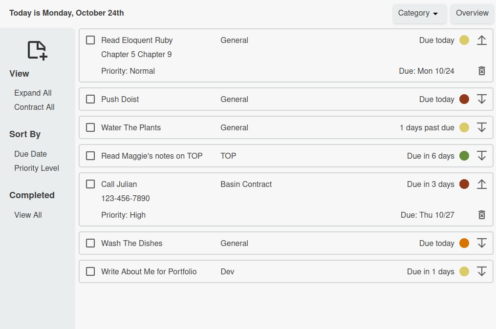

# Do-ist Todo List

A simple, clean and intuitive task management application. Sort by priority, due date, and user-created categories. 

This was built using vanilla JavaScript for practice with object handeling, SOLID principles and organization with the module pattern.

### Accessing The App

Check it out here: [Do-ist Todo List](https://technikka.github.io/DoistTodoList/)

Tasks are saved in localStorage. This means that they are lost when recent history/ browsing data is cleared or cookies are cleared. 

## Technologies Used

* JavaScript ES6
* CSS3
* HTML5
* Webpack
* LocalStorage 
* [Date-fns](https://github.com/date-fns/date-fns)
* [Lodash](https://lodash.com/)
* [css-loader](https://www.npmjs.com/package/css-loader)

## Description

A simple task manager. This version features:

* A clean and intuitive interface.

* Quick access to an overview of all tasks.

* Sort by due date, priority level, and category

* Expandable/Collapsable task items to show/hide additional information such a notes. Adjust each item individually or quickly expand/collapse all tasks in current view. 

* Create categories of tasks.

* Stores completed items for reference, until deleted.

* Tasks are saved in localStorage.

#### Screenshots

## Setup/Installation

To run this project locally:

1. Clone this repository
2. Run `npm install` to install dependencies
3. Run `npx webpack serve` to start development server

### Reflections as a student:

It didn't matter much for the purposes of this project which features I chose to implement. I was most intrigued to work on the sort functions and expanding/collapsing views. Time ran out before implementing the obvious 'edit task' feature. 

I re-designed my objects and modules several times throughout this project, trying to find a system I liked for separating DOM logic and application logic, and determining in some instances (like exiting out of a menu or modal after some action is performed), what should go where. Where I landed with this project is a definite improvement from past projects, but should remain a focus into the future.

### What's Next

If I were to revist this project, the next version would likely include:

* The ability to edit a task.
* Keyboard support
* Improved handeling of completed items
* Search bar
* Tool to manage catergories
* Drag and drop functionality for moving items between lists.
* Mobile and tablet design
